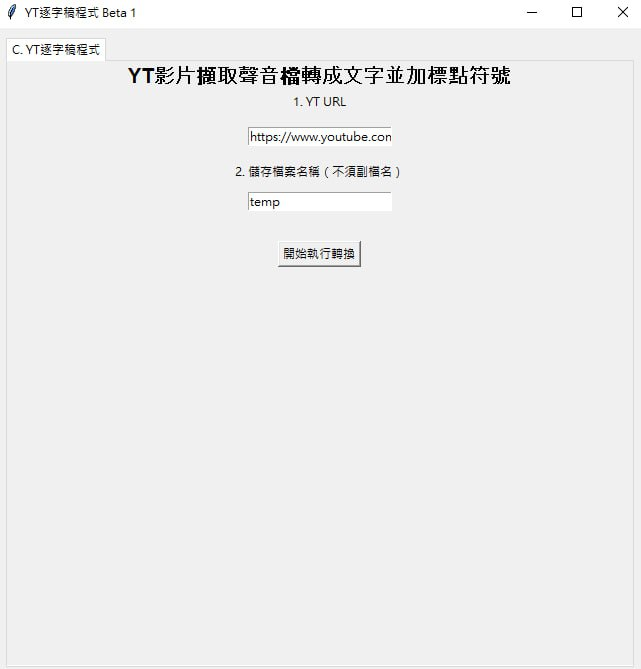
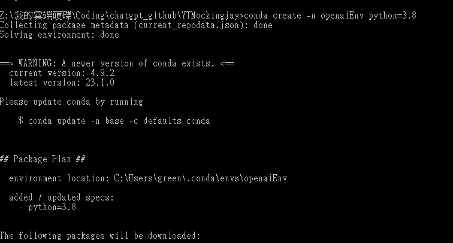
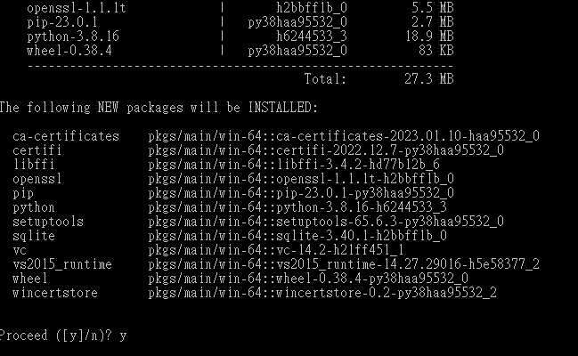
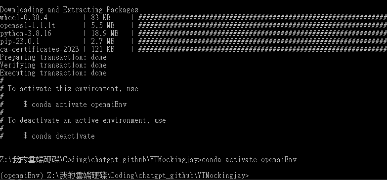
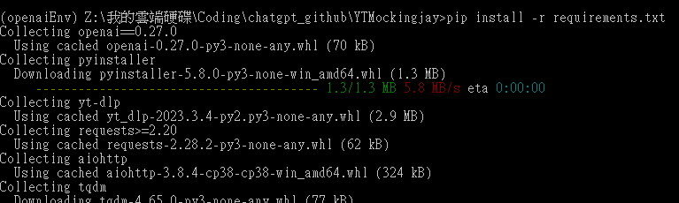
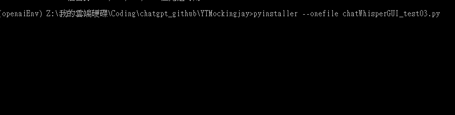
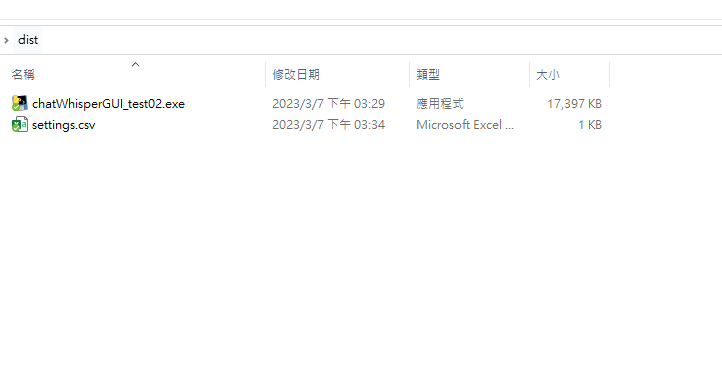
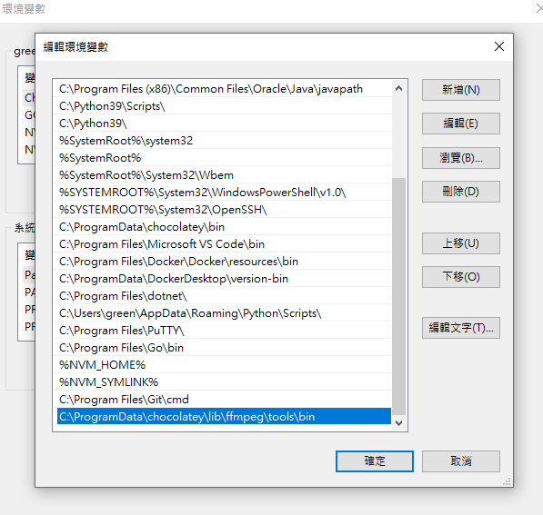
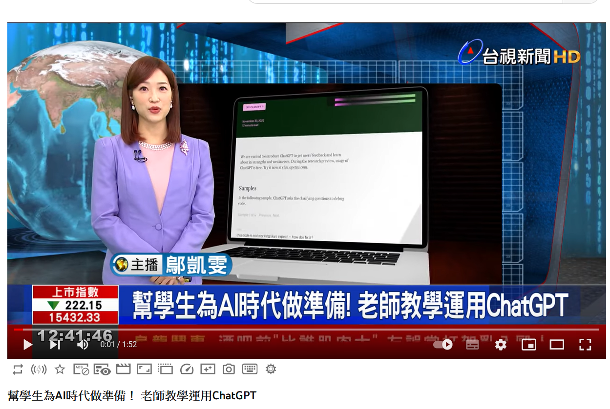
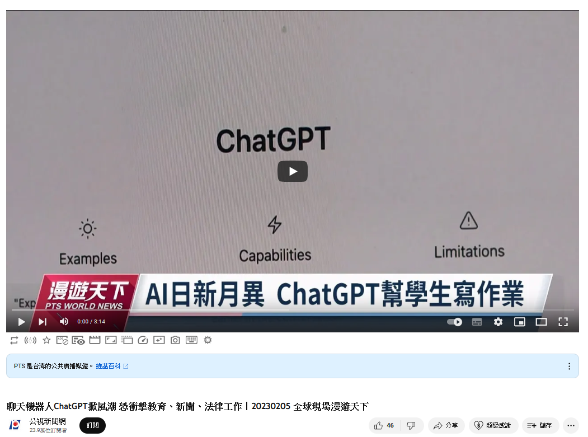

# YTMockingjay YT學舌鳥
# Youtube Speech to Text Converter使用OPENAI的GPT3.5 turbo和Whisper模型API，自動擷取Youtube影片的聲音，擷取出來成mp3，最後轉換成文字並加標點符號成幾乎完整的文章。

  

## [TelegramBot Vercel GPT3.5 turbo/ChatGPT版本部屬](https://github.com/pyfbsdk59/Flask-official-ChatGPT-TelegramBot-Vercel)

  

## [TelegramBot Render GPT3版本部屬](https://github.com/pyfbsdk59/Flask-ChatGPT-TelegramBot-Render)

  

## [LineBot Django Vercel GPT3版本部屬](https://github.com/pyfbsdk59/Django-ChatGPT-linebot-Vercel)

  

## [TelegramBot Golang Render GPT3版本部屬](https://github.com/pyfbsdk59/Golang-ChatGPT-TelegramBot-Render)

  

  

## [LineBot Golang Render GPT3版本部屬](https://github.com/pyfbsdk59/Golang-ChatGPT-linebot-Render)

  

### [English](https://github.com/pyfbsdk59/YTMockingjay/blob/main/README_en.md)
### [日本語](https://github.com/pyfbsdk59/YTMockingjay/blob/main/README_jp.md)

#### 0. Update: 3/9 更改system prompt輸入位置，請在settings.csv第二行修改輸入即可，勿斷行到第三行。

#### 1. 本專案參考了以下前輩的方案改成製作：

https://github.com/ywchiu/largitdata/blob/master/code/Course_220.ipynb

#### 2. 若使用Anaconda版的Python，請創立虛擬環境（名稱自取）。

        conda create -n openaiEnv python=3.8

  

  

#### 3. 進入虛擬環境，安裝相關依賴。

        conda activate openaiEnv

  

        pip install -r requirements.txt

  

#### 4. 輸入以下指令，創造執行檔。

        pyinstaller --onefile chatWhisperGUI_test03.py

  

#### 4. 執行檔在dist資料夾中，settings.csv請放在同資料夾。你的OPENAI的TOKEN請設在settings.csv的第一行，注意不要按Enter跑到第二行。

  

#### 5. 請按exe執行檔就可以開始執行。

#### 6. Windows上要安裝FFmpeg才能順利跑。可以用chocolatey來安裝FFmpeg，也要設定PATH，重開機才生效。可以玩玩看。結果稍有錯字，但已很厲害。因為Whisper模型的限制，影片不能超過9-10分鐘。建議用1-2分鐘的新聞來跑跑看。

#### 7. 安裝Chocolatey，請參考以下連結。

https://ithelp.ithome.com.tw/articles/10242201

#### 8. 安裝Chocolatey後，請在Powershell輸入以下指令安裝FFMpeg。

        choco install ffmpeg

#### 9. 安裝完必須手動增加環境變數PATH。Windows下的路徑類似如下。

        C:\ProgramData\chocolatey\lib\ffmpeg\tools\bin

  

#### 10. 設定完成後請重開機才會生效。

#### 11. 範例YT影片1

        https://www.youtube.com/watch?v=WfdxMh-57bE

  

#### 12. Whisper 初步結果

歡迎回來台視五肩新聞 AI聊天機器人ChatGPT爆紅 震撼全美教育界 很多學校擔心學生會用來作弊或是抄襲 禁止在課堂上使用 但肯塔基州有一名小學老師 反倒運用ChatGPT融入教學 幫助學生為AI時代的來臨提前做好準備 ChatGPT上線之後聲名大噪 教育界反應兩極 一方 認為使用ChatGPT就是作弊、抄襲 而且產出的文字內容常常似是而非 另一方則認為ChatGPT具有教學潛力 為學生帶來不同的體驗 肯塔基州的小學老師皮爾希 並沒有把ChatGPT當作洪水猛獸 而是用來教學生如何寫作 甚至一起編排戲劇 皮爾希的教學經驗長達17年 隨著ChatGPT的風潮席捲全球 他認為下一代絕對需要好好的學會 運用這種新科技 以免被時代淘汰 現代的孩子許多都是3C族 跟著元宇宙一起成長 ChatGPT聊天機器人亮相之後 更是直接宣告人類跟AI共存的時代來臨 如何善用科技幫助學習 也將成為順應世界潮流的必備能力 在未來的世界

#### 13. ChatGPT加標點符號並適切地斷行和分段結果

以下為文章整理：
，學生必須具備和優化人工智慧的相處能力，並運用人工智慧的力量來解決問題。ChatGPT的登場，可說是這一趨勢的開端，也因此受到 全球教育界的高度重視。

不過，教育界對於ChatGPT的態度並不完全一致，有人擔心學生會利用它進行作弊或抄襲，因此在學校禁止使用。但是，也有老師像肯塔 基州的小學老師皮爾希，運用ChatGPT作為教學工具，幫助學生學習如何運用這項新技術來寫作，甚至一起編排劇本，提前為未來的大学 和工作做好準備。

ChatGPT帶來的不僅是新科技，也是一種以教學為導向的學習體驗，其中包含著學生們對於科技的樂趣、愛好和好奇心。現代的學生都是3C族，隨著元宇宙的興起，他們需要適應這個快速發展的數位時代。ChatGPT的出現，也讓人們更清楚地看到，未來人與AI的共存是必然的選擇，如何適應和應用人工智慧，成為當下重要的課題。

#### 14. 範例YT影片2

        https://www.youtube.com/watch?v=T6ok2Yxz0bQ

  

#### 15. Whisper 初步結果

二零一六年一場 全球矚目的圍棋賽局上 人工智慧off go 擊敗韓國棋王李世石 掀起軒然大波 隨著AI技術日漸成熟 人類擔憂工作會被科技取代 像是近來出現的 ChatGPT 連學校作業 都有辦法代寫 ChatGPT 是由OpenAI公司 發行 使用者 可以藉由提問 或發佈任務來解決問題 因此威脅到教育 新聞 及法律工作者 金融網站商業內部 更指出部分亞馬遜公司的工程師 已經開始使用ChatGPT 來協助編碼 工程師 或許會成為下一個失業的職位 不過也有人認為AI 還不足以取代人類 像是處理法律事務 AI沒有專業執照 將無法取得人類的信任 有專家則鼓勵校園善用 這項新科技 指出AI 只是一種工具 人類最終要學習如何使用 而非完全信任 它或被它取代 AI是威脅 還是好助手 全看 人類選擇 如何使用它 只要建立 合理的規範 避免濫用 科技 就能改善人類的生活 公視新聞兩院編譯

#### 16. ChatGPT加標點符號並適切地斷行和分段結果

以下為文章整理：
二零一六年，一場全球矚目的圍棋賽局上，人工智慧Off Go擊敗韓國棋王李世石，掀起軒然大波。隨著AI技術日漸成熟，人類擔憂工作會被科技取代。像是近來出現的ChatGPT，連學校作業都有辦法代寫。ChatGPT是由OpenAI公司發行，使用者可以藉由提問或發佈任務來解決問題。因此，威脅到教育、新聞及法律工作者、金融網站商業內部。更指出，部分亞馬遜公司的工程師已經開始使用ChatGPT來協助編碼 。工程師或許會成為下一個失業的職位。不過也有人認為AI還不足以取代人類，像是處理法律事務。AI沒有專業執照，將無法取得人類的信任。有專家則鼓勵校園善用這項新科技，指出AI只是一種工具，人類最終要學習如何使用，而非完全信任它或被它取代。AI是威脅還是好助手，全看人類選擇如何使用它。只要建立合理的規範，避免濫用，科技就能改善人類的生活。公視新聞兩院編譯。

